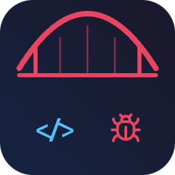
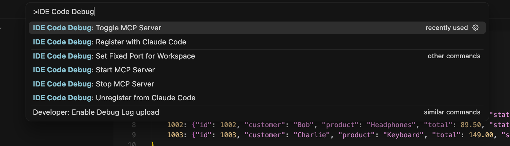
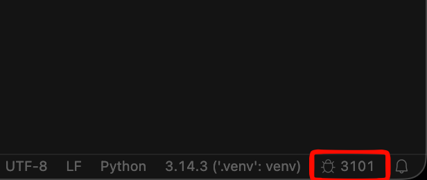

<p align="center">
  
</p>

[](https://opensource.org/licenses/MIT)

# IDE Code Debug Bridge

**Give your AI the power to debug like a human — visually, in real time, inside your IDE.**

IDE Code Debug Bridge is a VS Code / Cursor extension that exposes the full debugger as MCP tools for [Claude Code](https://docs.anthropic.com/en/docs/claude-code). Claude can set breakpoints, start debug sessions, step through code, inspect variables, evaluate expressions — all while you watch it happen live in your editor.

No print statements. No manual reproduction. You describe the bug, the AI investigates.

---

## Table of Contents

- [Why this exists](#why-this-exists)
- [See it in action](#see-it-in-action)
- [How it works](#how-it-works)
- [Requirements](#requirements)
- [Installation](#installation)
- [MCP Tools Reference](#mcp-tools-reference)
- [Smart features](#smart-features)
- [Configuration](#configuration)
- [Security](#security)
- [License](#license)

---

## Why this exists

Debugging today with AI follows a frustrating loop: you paste an error, the AI guesses a fix, you test it, it's wrong, you paste more context, repeat. The AI never actually *sees* what's happening at runtime.

This extension changes that. The AI gets direct access to the debugger — the same tool you use — and can:

- **Start your application** in debug mode using your existing launch configurations
- **Place breakpoints** on exact lines without touching your source code
- **Trigger a request** (via curl, a test, whatever) and **wait for the breakpoint to hit**
- **Read every variable** in scope — locals, globals, nested objects
- **Evaluate arbitrary expressions** in the live context (`len(items)`, `response.status_code`, `user.email`)
- **Step through execution** line by line, deciding at each step whether to go deeper or continue
- **Produce a diagnosis** based on what it actually observed, not what it guessed

The developer sees all of this happening in real time — breakpoints appear, the yellow execution marker moves, variables populate the debug panel. It's like pair programming with someone who can operate the debugger at machine speed.

---

## See it in action

> **Prompt:** "Use the ide-debug MCP tools to debug why `/api/orders/1001` returns 404. Start a debug session, set breakpoints, inspect variables at runtime."

https://github.com/user-attachments/assets/332b21ca-da22-4714-a4ee-bf04f2cd18d5

The AI sets breakpoints, starts the debug session, triggers a request, inspects variables at runtime — and finds the bug. All while you watch it happen live in the IDE.

---

## How it works

The extension runs an MCP server inside VS Code that translates tool calls into debug API operations. Works with **any debug adapter** — Python, Node.js, Go, Rust, Java.

See [ARCHITECTURE.md](ARCHITECTURE.md) for diagrams, source structure, and debugging workflows.

---

## Requirements

- VS Code 1.85+ or Cursor
- [Claude Code](https://docs.anthropic.com/en/docs/claude-code) (or any MCP client supporting Streamable HTTP transport)
- A debug adapter for your language (Python: debugpy, Node.js: pwa-node, etc.)

---

## Installation

### 1. Install the extension

Search for `ygorhora.ide-code-debug` in the Extensions panel, or install from:

- **VS Code**: [Visual Studio Marketplace](https://marketplace.visualstudio.com/items?itemName=ygorhora.ide-code-debug)
- **Cursor**: [Open VSX Registry](https://open-vsx.org/extension/ygorhora/ide-code-debug)

### 2. Register with Claude Code

Open the Command Palette (`Cmd+Shift+P` / `Ctrl+Shift+P`) and run:

> **IDE Code Debug: Register with Claude Code**

<p align="center">
  
</p>

This automatically runs `claude mcp add` with the correct port for your project. Done — Claude Code can now use the debugger.

> **Note:** This extension is built for [Claude Code](https://docs.anthropic.com/en/docs/claude-code). It uses the MCP Streamable HTTP transport, so it's compatible with any MCP client that supports it, but the setup commands and workflows are optimized for Claude Code.

You can also register (or unregister) by clicking the **bug icon** in the status bar — it opens a menu with all available actions.

### 3. Reload your editor

The extension auto-starts the MCP server on port 3100. You'll see the **port number in the status bar** — click it to access a quick menu: stop/start the server, change port, register/unregister with Claude Code.

<p align="center">
  
</p>

---

## MCP Tools Reference

### State & Configuration

| Tool | Description |
|------|-------------|
| `get_state` | Current debugger state: active session, paused status, file/line, stop reason |
| `get_launch_configs` | List launch configurations from `.vscode/launch.json` across all open IDE windows. Optional `folder` filter. |
| `list_sessions` | List all active debug sessions with their status |

### Session Control

| Tool | Description |
|------|-------------|
| `start_session` | Start a debug session by launch config name. Optional `folder` to target a specific workspace — automatically routes to the correct IDE window. |
| `stop_session` | Stop the active debug session |
| `restart_session` | Restart a debug session (stop + start with the same config) |

### Breakpoints

| Tool | Description |
|------|-------------|
| `set_breakpoints` | Set breakpoints at specific lines (supports conditional breakpoints) |
| `remove_breakpoints` | Remove breakpoints from a file (specific lines or all) |
| `list_breakpoints` | List all active breakpoints across all files |

### Code Search

| Tool | Description |
|------|-------------|
| `find_code_line` | Search for a code snippet in a file and return matching line numbers. Use before `set_breakpoints` to find the exact line. |

### Execution Control

| Tool | Description |
|------|-------------|
| `continue_execution` | Resume until next breakpoint or program end |
| `step_over` | Execute current line, stop at next line (skip function internals) |
| `step_into` | Step into the function call on the current line |
| `step_out` | Step out of the current function back to the caller |
| `pause` | Pause a running program |

### Inspection

| Tool | Description |
|------|-------------|
| `get_threads` | List all active threads |
| `get_stack_trace` | Get the call stack of a paused thread |
| `get_variables` | **Smart resolution** — automatically resolves thread → frame → scope → variables in a single call. Supports nested expansion. |
| `evaluate` | **Smart evaluation** — evaluates an expression in the debug context. If a variable isn't found in the current frame, automatically searches other frames in the call stack. |

### Synchronization

| Tool | Description |
|------|-------------|
| `wait_for_stop` | Block until the debugger pauses (breakpoint hit, step complete, exception). Returns immediately if already paused. Essential for the flow: start session → trigger request → wait for breakpoint. |

---

## Smart features

### Smart variable resolution

`get_variables` resolves the full chain automatically — you don't need to call `get_threads` → `get_stack_trace` → `get_scopes` → `get_variables` manually. One call returns everything:

```json
{
  "frame": { "name": "get_order", "file": "routes.py", "line": 294 },
  "scopes": {
    "Locals": [
      { "name": "order_id", "value": "64063", "type": "str" },
      { "name": "request", "value": "<Request>", "type": "Request",
        "children": [
          { "name": "method", "value": "GET", "type": "str" },
          { "name": "url", "value": "http://localhost:8000/api/orders/64063", "type": "URL" }
        ]
      }
    ]
  }
}
```

### Smart evaluate with frame walking

When you evaluate an expression and it fails with a `NameError` in the current frame, the extension automatically walks up the call stack to find the frame where that variable exists:

```
evaluate("request.headers")
  → Frame 0 (validate_token): NameError
  → Frame 1 (get_endpoint):   ✓ Found! Returns headers + tells you which frame resolved it
```

No need to manually inspect the stack trace and specify a `frameId`.

### Conditional breakpoints

Set breakpoints that only trigger when a condition is met:

```
set_breakpoints("routes.py", [294], condition="order_id == '64063'")
```

The debugger only pauses when `order_id` is the specific value you're investigating.

---

## Configuration

| Setting | Default | Description |
|---------|---------|-------------|
| `ideCodeDebug.port` | `3100` | Starting port for the MCP server (localhost only) |
| `ideCodeDebug.portRange` | `10` | Number of ports to scan from the base port. Set to `1` to disable auto-scanning. |
| `ideCodeDebug.portRetries` | `3` | Retry attempts per port before moving to the next one |
| `ideCodeDebug.maxRequestBodyMB` | `1` | Maximum request body size in MB. Protects the extension host from oversized payloads. |
| `ideCodeDebug.allowedPaths` | `[]` | Glob patterns restricting which files MCP tools can access. Empty = no restriction. |
| `ideCodeDebug.autoStart` | `true` | Auto-start the server when the editor opens |

### Multiple editor windows

Each editor window runs its own MCP server on a separate port. When you work with multiple projects simultaneously, each one needs its own fixed port so Claude Code always connects to the right window.

**Recommended setup for multi-window workflows:**

1. Open each project in its own editor window
2. In each window, run from the Command Palette:
   > **IDE Code Debug: Set Fixed Port for Workspace**
3. Assign a unique port to each project (e.g. `3100`, `3200`, `3300`)
4. Choose **"Restart & Register with Claude"** when prompted

This saves the port in the project's `.vscode/settings.json` and registers it with Claude Code in one step. The next time you open that project, the extension will read the port from your `.mcp.json` and start on exactly that port.

**How port resolution works on startup:**

1. Uses `ideCodeDebug.port` from workspace settings (`.vscode/settings.json`) — explicit user choice takes priority
2. Reads `.mcp.json` in the workspace — if `ide-debug` is configured with a URL like `localhost:3200`, uses port `3200`
3. Falls back to the default (`3100`)

If the preferred port is busy, the extension tries the next ports in the range (configurable via `portRange`). When you use "Set Fixed Port", `portRange` is set to `1` so the extension only tries that exact port and shows a clear error if it's taken.

**Cross-window aggregation:** Even if Claude Code connects to port 3100 (project A), calling `get_launch_configs` returns configs from **all** open windows. Calling `start_session` with a `folder` parameter automatically routes the request to the correct window.

### File path restriction

By default, all files accessible to VS Code can be read via MCP tools (`find_code_line`, `set_breakpoints`, `remove_breakpoints`). To restrict access to specific directories, configure `allowedPaths` with glob patterns:

```json
"ideCodeDebug.allowedPaths": [
  "/home/me/projects/**",
  "/tmp/**"
]
```

When set, any tool call targeting a file outside these patterns will be rejected with a clear error message. Changes to this setting take effect immediately — no restart needed.

> **Tip:** Leave empty (default) for unrestricted access on single-user machines. Use glob patterns on shared machines or when you want to prevent the AI from reading files outside your project.

### Commands (via Command Palette or status bar menu)

| Command | Description |
|---------|-------------|
| **Register with Claude Code** | Runs `claude mcp add` with the current port for this project. Replaces any existing registration. |
| **Unregister from Claude Code** | Runs `claude mcp remove` to remove the MCP entry from this project. |
| **Set Fixed Port for Workspace** | Assigns a fixed port to this project (saved in `.vscode/settings.json`). Optionally restarts the server and registers with Claude Code. |
| **Start MCP Server** | Manually start the server if auto-start is disabled. |
| **Stop MCP Server** | Stop the server and free the port. |

All commands are also accessible by clicking the **bug icon** in the status bar, which shows a contextual quick menu.

---

## Security

This extension exposes powerful debugger capabilities over HTTP. Understanding the security model helps you use it safely.

### How it's protected

- **Localhost only**: The MCP server binds exclusively to `127.0.0.1` — it is **not reachable from the network**. Only processes running on your machine can connect.
- **Request size limits**: All incoming requests are capped at a configurable size (`maxRequestBodyMB`, default 1 MB) to protect the extension host from oversized payloads.
- **Session limits**: A maximum of 10 concurrent MCP sessions, with idle sessions automatically reaped after 5 minutes.
- **File path restriction**: Optionally restrict which files the MCP tools can access via `allowedPaths` glob patterns.

### What to be aware of

- **No authentication**: Any process on your local machine can connect to the MCP server and control the debugger. This follows the same model as VS Code's own Debug Adapter Protocol (DAP), which also runs on localhost without authentication.
- **Expression evaluation**: The `evaluate` tool can run arbitrary expressions in the context of the program being debugged. This is the same as typing in the VS Code Debug Console — it's powerful by design, but means the AI can execute code within the debuggee process.
- **Variable inspection**: The `get_variables` tool returns all in-scope variables, which may include sensitive values (API keys, tokens, credentials) that your application has in memory at runtime.
- **File reading**: The `find_code_line` tool can read the contents of any file accessible to VS Code (unless restricted by `allowedPaths`).

### Best practices

1. **Use `allowedPaths` on shared machines**: If you're on a multi-user system or want to limit file access, configure glob patterns to restrict the AI to your project directories:
   ```json
   "ideCodeDebug.allowedPaths": ["/home/me/projects/**"]
   ```

2. **Be mindful of secrets in debug sessions**: When debugging applications that handle credentials, database connections, or API keys, remember that the AI can see these values through `get_variables` and `evaluate`. This is inherent to debugging — the same values are visible in VS Code's Variables panel.

3. **Don't debug production processes**: This extension is designed for local development. Never attach it to a production process or expose the MCP port beyond localhost.

4. **Review launch configurations**: The `get_launch_configs` tool exposes your `.vscode/launch.json` contents, which may include environment variables. Avoid storing production secrets in launch configurations.

5. **Keep the extension updated**: As with any tool that handles code execution, use the latest version to benefit from security improvements.

---

## License

This project is licensed under the [MIT License](LICENSE).

Copyright (c) 2025 Ygor Hora and Contributors.
